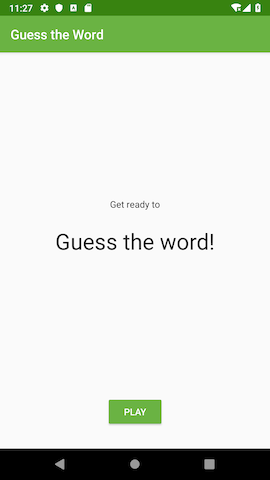
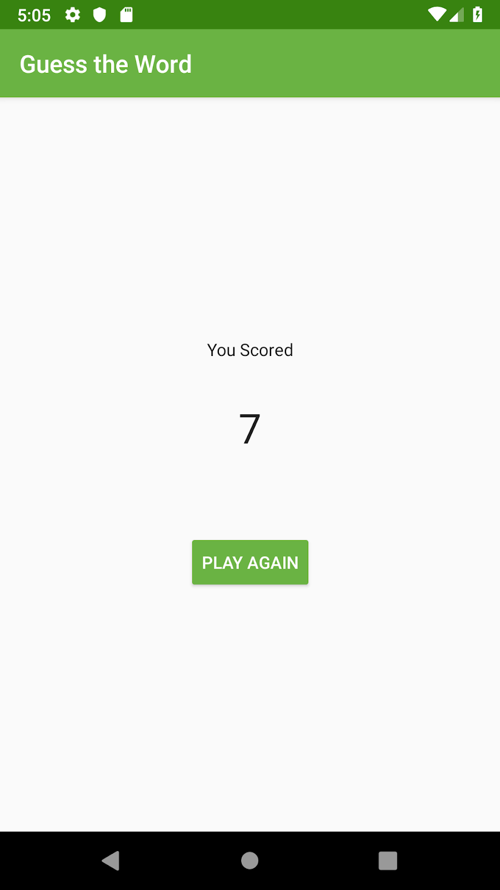

# Android-Projects

Managing multiple Android Applications modules in a single project.

## Android Trivia
The Android Trivia application is an application that asks the user trivia questions about Android
development. It makes use of the [Navigation component](https://developer.android.com/guide/navigation) within Jetpack to move the user between
different screens. Each screen is implemented as a Fragment. The app navigates using buttons, the Action Bar, and the Navigation Drawer.

## Guess The Word
This starter app is a two player game, GuessTheWord. It is a word guessing app you can play with one or more friends.
To play, hold the device in landscape, facing away from you with your thumbs on the Skip and Got It buttons.
Your friends can then give you clues to help you guess the word. If you get the word right, press Got It. If you're stuck, press Skip.
This code demonstrates the [Android Architecture components](https://developer.android.com/jetpack/guide), [ViewModel](https://developer.android.com/topic/libraries/architecture/viewmodel) and [ViewModelFactory](https://developer.android.com/reference/android/arch/lifecycle/ViewModelProvider.Factory).

&nbsp; &nbsp; 

## Sleep Quality Tracker
The sleep tracker application is an app for recording sleep data for each night.  You can record a start and stop time, assign a quality rating, and clear the database.
This version of the app contains the [Room database](https://developer.android.com/training/data-storage/room) that holds the sleep data and instrumented tests to verify that this backend works.
Later used the [RecyclerView](https://developer.android.com/guide/topics/ui/layout/recyclerview) to display a list of results in a RecyclerView instead of a static ScrollView.

## MarsRealEstate
MarsRealEstate is a simple demo app using ViewModel & LiveData with Retrofit, Glide and Moshi libraries in Kotlin.

This app demonstrates the following views and techniques:
- [Retrofit](https://square.github.io/retrofit/) to make api calls to an HTTP web service.
- [Moshi](https://github.com/square/moshi) which handles the deserialization of the returned JSON to kotlin data objects.
- [Glide](https://bumptech.github.io/glide/) to load and cache images by URL.

It leverages the following components from the Jetpack library:
- [ViewModel](https://developer.android.com/topic/libraries/architecture/viewmodel)
- [LiveData](https://developer.android.com/topic/libraries/architecture/livedata)
- [Data Binding](https://developer.android.com/topic/libraries/data-binding) with binding adapters.
- [Navigation component](https://developer.android.com/guide/navigation) with the SafeArgs plugin for parameter passing between fragments.
