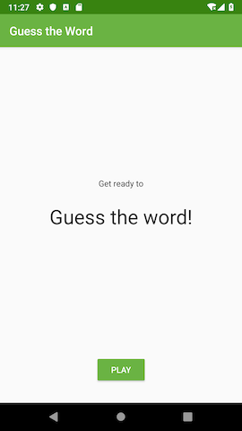
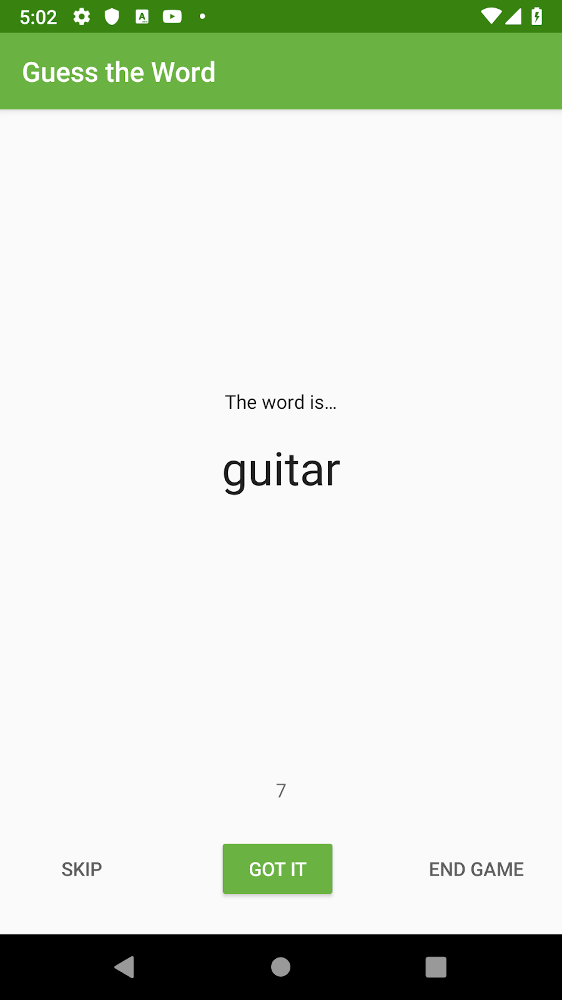
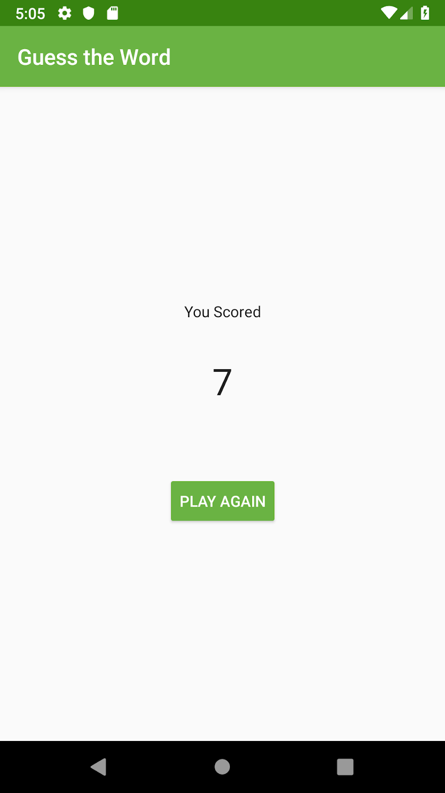

# Android-Projects

Managing multiple Android Applications modules in a single project.

## Android Trivia
The Android Trivia application is an application that asks the user trivia questions about Android
development. It makes use of the [Navigation component](https://developer.android.com/guide/navigation) within Jetpack to move the user between
different screens. Each screen is implemented as a Fragment. The app navigates using buttons, the Action Bar, and the Navigation Drawer.

## Guess The Word
This starter app is a two player game, GuessTheWord. It is a word guessing app you can play with one or more friends.
To play, hold the device in landscape, facing away from you with your thumbs on the Skip and Got It buttons.
Your friends can then give you clues to help you guess the word. If you get the word right, press Got It. If you're stuck, press Skip.
This code demonstrates the [Android Architecture components](https://developer.android.com/jetpack/guide), [ViewModel](https://developer.android.com/topic/libraries/architecture/viewmodel) and [ViewModelFactory](https://developer.android.com/reference/android/arch/lifecycle/ViewModelProvider.Factory).

&nbsp; &nbsp; 